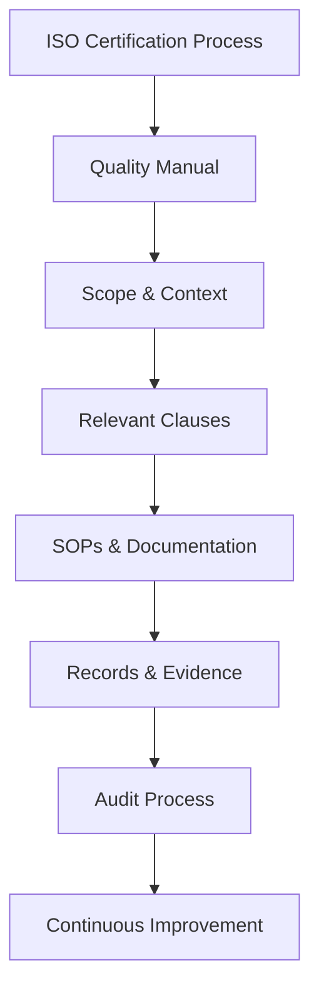

import { Callout, Steps, Step } from "nextra-theme-docs";

# 4. Lessons Learned and Best Practices

Pursuing ISO 13485 certification, especially as a startup or software company, can be a daunting task. However, with the right approach and mindset, it can also serve as an opportunity to streamline your processes and align your organization. Here are some key lessons learned and best practices to keep in mind.

## Align Certification with Internal Processes

The certification process should not be treated as a mere checklist or formality. Instead, it should be an integral part of your internal processes, helping you establish a scalable and sustainable system.

<Callout>
The regulatory framework can offer value beyond just certification. It can be a terrific way to align your organization and enforce practices like documentation and process monitoring, which are often overlooked in the day-to-day rush.
</Callout>

Involve your team in the process and communicate the rationale behind the certification. This will not only ensure buy-in but also help you leverage their expertise in shaping the processes that work best for your organization.

## Manage Time and Effort Effectively

ISO certification can be time-consuming and tedious, especially when it comes to generating documents and records. However, there are ways to manage this effort effectively:

<Steps>

### Step 1: Scope Properly

Scoping is crucial. By carefully defining the scope and context of your organization in the quality manual, you can minimize the areas you need to cover initially. This will save you time and effort, allowing you to focus on the most relevant aspects.

#### Example

"We decided to scope our initial certification to cover our core product, deferring aspects like post-market surveillance and customer feedback, as we were not yet commercialized. This allowed us to eliminate approximately one-third of the clauses from our initial audit."

### Step 2: Leverage Tools

Utilize tools like Notion to streamline your documentation and record-keeping processes. Notion's inline databases, linking capabilities, and automation features can significantly reduce the overhead of managing numerous documents and records.

### Step 3: Document Strategically

Rather than documenting what currently exists, focus on documenting your ideal processes. As a startup, your processes are likely to evolve rapidly. By documenting the desired state, you can then work towards implementing it, rather than constantly revising documentation.

</Steps>

## Advice for Startups and Software Companies

Startups and software companies face unique challenges in the certification process:

- **Software as a Medical Device:** Regulatory bodies are still catching up with the concept of software as a medical device. Expect some gray areas and clauses that may not directly apply to your processes.

- **Evolving Processes:** As a startup, your processes are likely to be in flux. It's important to acknowledge this in your documentation and be prepared to explain your approach to auditors.

- **Auditor Unfamiliarity:** Auditors may not be familiar with software development practices like version control systems (e.g., GitHub). Be prepared to educate them and map your processes to the regulatory requirements.

<Callout>
$\textbf{Tip:}$ Consider hiring a consultant who understands the regulatory landscape, but use them as a consultant, not a project manager. They can guide you, but the internal team should drive the certification process and documentation.
</Callout>

[linktext](/navigating-audit-process): During the audit process, remember that the auditors are not necessarily looking for perfection. They want to see that you have a system in place to identify and address potential issues as they arise.

[linktext](/navigating-audit-process/documentation-records): Comprehensive documentation and record-keeping are crucial. Utilize tools like Notion to streamline this process and demonstrate your commitment to quality assurance.

[linktext](/navigating-audit-process/software-development-processes): Be prepared to explain your software development processes and tools to auditors who may not be familiar with them. Map your processes to the regulatory requirements and provide clear documentation.

Ultimately, the key to a successful ISO 13485 certification journey is to approach it as an opportunity to streamline your processes and align your organization, rather than just a checklist to be completed. With the right mindset, tools, and strategies, you can navigate the certification process effectively, even as a startup or software company.