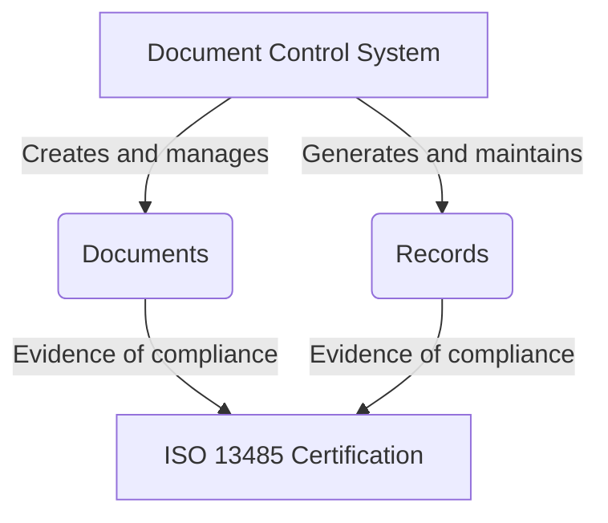

import { Callout, Steps, Step } from "nextra-theme-docs";

# Documentation and Records

Comprehensive documentation and meticulous record-keeping are crucial elements of the ISO 13485 certification process. The auditors place a significant emphasis on ensuring that your organization has a well-defined system for managing documents and records, as it demonstrates your commitment to quality assurance and adherence to established processes.

<Callout emoji="✨">
Documentation serves as the backbone of your quality management system, providing a clear roadmap for your processes, procedures, and policies. Records, on the other hand, act as evidence that these processes are being followed and implemented effectively.
</Callout>

During the audit, the auditors will scrutinize your documentation and records to assess whether your organization is compliant with the relevant clauses of the ISO 13485 standard. They will examine various types of documents, including:

- **Quality Manual**: This document outlines your organization's quality management system and serves as a comprehensive guide to your processes, policies, and procedures.
- **Standard Operating Procedures (SOPs)**: These documents provide detailed instructions for carrying out specific tasks or processes within your organization.
- **Forms and Templates**: These standardized documents ensure consistency in the way information is collected and recorded.

In addition to these documents, the auditors will also review the records you maintain as evidence of your compliance. Examples of such records include:

- Meeting minutes
- Corrective and Preventive Action (CAPA) records
- Training records
- Design history records
- Validation records

<Steps>

### Step 1: Implement a Document Control System

Adopt a robust document control system to manage the creation, review, approval, distribution, and archiving of your documents. This system should ensure that the most up-to-date versions of documents are readily available and that obsolete documents are promptly removed from circulation.

We recommend using a tool like [Notion](/navigating-audit-process) for document control. Notion offers several advantages over traditional methods, such as version control, easy collaboration, and automated record generation.

### Step 2: Maintain Comprehensive Records

Establish processes for generating and maintaining records that demonstrate your compliance with the ISO 13485 standard. These records should be complete, accurate, and easily retrievable when required.

Consider automating record generation using tools like [Notion AI functions](/navigating-audit-process) or custom scripts. This can help ensure that records are consistently created and maintained, reducing the risk of human error.

</Steps>

<Callout emoji="📝">
Remember, the auditors are not primarily concerned with the content of your documents and records. Instead, they focus on verifying that you have a well-defined system in place and that you are following it consistently.
</Callout>

By implementing a robust document control system and maintaining comprehensive records, you can demonstrate to the auditors that your organization is committed to quality and adheres to the principles of the ISO 13485 standard.

The diagram illustrates the role of the document control system in creating and managing documents, as well as generating and maintaining records. Both documents and records serve as evidence of compliance, ultimately contributing to the successful achievement of ISO 13485 certification.