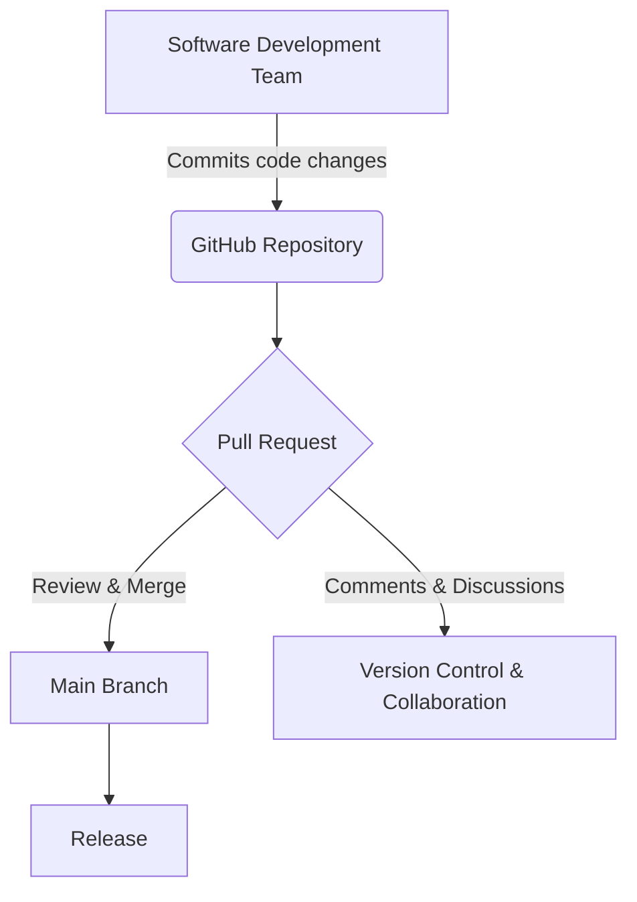
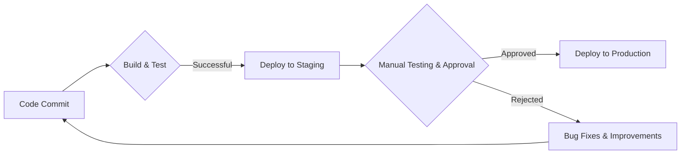

import { Callout, Steps, Step } from "nextra-theme-docs";

# 3.2 Software Development Processes

One of the unique challenges faced during the ISO 13485 certification process was addressing the auditors' unfamiliarity with modern software development practices and tools. As a software company, many of the standard clauses and requirements were not directly applicable to our processes, leading to some confusion and pushback from the auditors.

## Explaining GitHub and Version Control

A prime example of this was when we had to explain the concept of GitHub and version control to the auditors. They were initially perplexed by our use of a platform like GitHub for tracking changes, managing code repositories, and collaborating on software development.

<Callout emoji="💡">
Instead of relying on traditional documentation methods like meeting minutes or change logs, our development processes were largely automated and integrated into GitHub through features like comments, pull requests, and merge commits.
</Callout>

To address this, we had to take a step back and provide a comprehensive explanation of how GitHub functions and how it aligns with the documentation and versioning requirements outlined in the ISO 13485 standard. We demonstrated that while the format may be different, GitHub effectively achieves the same goals of tracking changes, maintaining version control, and facilitating collaboration among the development team.

## Mapping Processes to Regulatory Requirements

Another challenge was mapping our agile software development methodology to the more linear and structured processes outlined in the ISO 13485 standard. The auditors were accustomed to a more traditional waterfall approach, with clearly defined phases like planning, requirements gathering, design, implementation, and testing.

<Steps>

### Step 1

We had to demonstrate that while our processes may seem more iterative and fluid, we still adhered to the core principles and requirements set forth by the standard. This involved walking the auditors through our development cycle, highlighting how we incorporated elements like risk assessment, design reviews, and validation testing at various stages.

### Step 2

Additionally, we showcased how our use of agile methodologies and tools like Jira or Trello enabled us to effectively manage requirements, prioritize tasks, and maintain traceability throughout the development lifecycle.

</Steps>

<Callout emoji="⚠️">
It's important to note that the goal was not to convince the auditors that our approach was superior, but rather to establish that our processes were compliant with the regulatory requirements, despite their seemingly non-traditional nature.
</Callout>

## Automation and Continuous Integration

Another area where we faced scrutiny was our reliance on automation and continuous integration/continuous deployment (CI/CD) pipelines. The auditors were accustomed to more manual processes, with clearly defined handoffs and sign-offs at various stages.

We had to explain how our automated build, testing, and deployment processes still incorporated the necessary checks and balances, including code reviews, static analysis, and regression testing. We demonstrated how our CI/CD pipelines enforced strict quality gates and ensured that only thoroughly tested and validated code made it to production.

<Callout emoji="📝">
Throughout these discussions, we emphasized the importance of clear documentation, traceability, and adherence to established processes and procedures, even if the implementation details differed from traditional approaches.
</Callout>

By patiently explaining our processes, providing concrete examples, and demonstrating how we addressed the core requirements of the ISO 13485 standard, we were able to overcome the auditors' initial skepticism and gain their acceptance of our software development practices.

[← Back to Navigating the Audit Process](/navigating-audit-process)